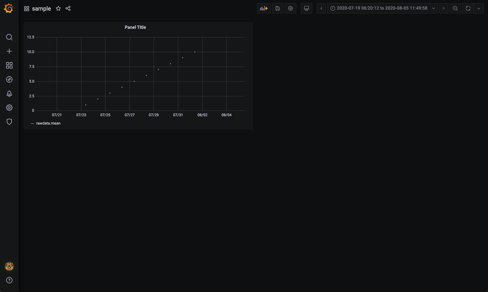

# influxdb-grafana
influxdbとgrafanaをDockerでサクッと立ち上げる。

## 検証環境
- Mac or Linux (Windows未検証)
- docker
- docker-compose

## 起動
- docker-composeで起動
```
docker-compose up -d (sudoが最初に必要な場合あり)
```

- python scriptにてデータベース作成&サンプルデータ投入   
必要なモジュールは[requirements.txt](/requirements.txt)を参照。
```
python write_sample_data.py
```

## 動作確認
ブラウザでgrafana(http://localhost:3000)にアクセス  
初期usernameとpasswordはadmin / admin (初回ログイン後、変更できる)


- Dashboard (sample)に投入したデータが表示される。

  

以上。
